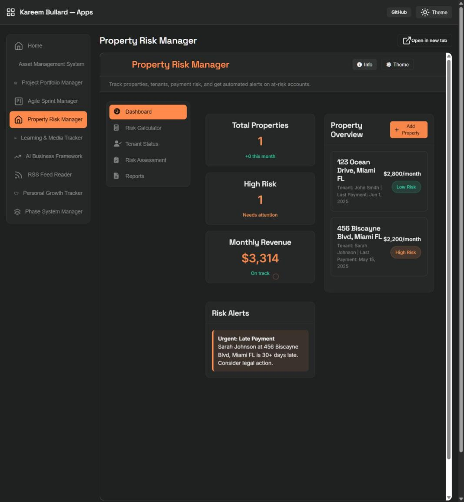

# landlord-risk-manager-web

Live: [https://kareembullard.github.io/landlord-risk-manager-web/](https://kareembullard.github.io/landlord-risk-manager-web/)

**Property Risk Manager** — track properties, tenants, payment risk, and get automated alerts on at-risk accounts.

## What it is

A self-contained, single-file demo web app, part of my [app portfolio](https://kareembullard.github.io/). Originally published in the [project-showcase](https://github.com/kareembullard/project-showcase) collection (still live at [apps.kareembullard.com](https://apps.kareembullard.com)), now split into its own repo so every app in the portfolio follows the same one-repo-per-app pattern.

- **Zero build step** — one `index.html` with HTML, CSS, and JS inline. Open it in a browser and it runs.
- **Local persistence** — demo data is seeded on first load and autosaved to `localStorage`. Edits survive a refresh; nothing is ever sent to a server.
- **Dark/light theme**, an Info modal describing the app, and a shared cross-app nav bar (Home + Apps dropdown) linking the whole portfolio together.

## Disclaimer

This is a **portfolio demo**, not a production product. All data shown is fictional sample data.

## Screenshot

